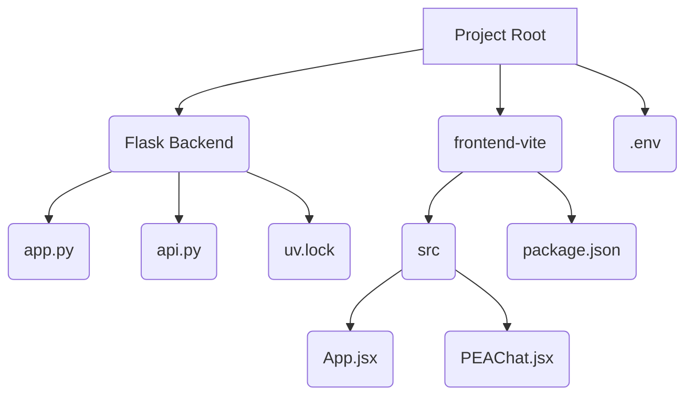

# MyPrompt

## Project Description

The application consists of a Python/Flask backend and a React.js/Vite frontend, supporting multiple LLM providers.

## Technology Stack

*   **Backend:** Python, Flask, UV
*   **Frontend:** React.js, Vite
*   **LLM Providers:**
    - Google (Gemini 1.5/2.5/Flash/Pro)
    - OpenAI (GPT-4, GPT-3.5)
    - Anthropic (Claude 2, Claude 3)
    - OpenRouter (multiple models)
    - Groq (Llama3, Mixtral, Gemma)
    - Mistral
    - Ollama (local models)
    - LM Studio (local models)
    - Cerebras
    - SambaNova

## Project Structure



## Setup Instructions

To set up and run MyPrompt, follow these steps:

### Prerequisites

*   **Python 3.7+:** Ensure Python is installed on your system.
*   **Node.js and npm:** Ensure Node.js and npm are installed.
*   **UV:** Install UV by following the instructions on the [UV documentation](https://github.com/astral-sh/uv).

### Backend Setup

1.  Clone the GitHub repo into a directory of your chosing:
    * On Windows:
        ```bash
        git clone https://github.com/AlexJ-StL/MyPrompt.git
        ```
2.  Navigate to the project root directory in your terminal.
    * On Windows:
    ```bash
    cd MyPrompt
    ```
3.  Create a virtual environment using UV:
    ```bash
    uv init && uv .venv
    ```
4.  Activate the virtual environment:
    *   On Windows:
        ```bash
        .\.venv\Scripts\activate
        ```
    *   On macOS and Linux:
        ```bash
        source ./.venv/bin/activate
        ```
5.  Install the backend dependencies using UV:
    ```bash
    uv sync
    ```
6.  **API Key Configuration:**
    - Copy the `.example.env` file to `.env`:
      ```bash
      cp .example.env .env
      ```
    - Edit the `.env` file to include your API keys for the providers you want to use
    - For OpenAI-compatible providers (OpenRouter, Groq, Mistral), you can use your OpenAI API key as a fallback:
      ```bash
      OPENAI_API_KEY=your_openai_api_key_here
      ```
    - For local providers (Ollama, LM Studio), you don't need API keys but need to run the respective applications

### Frontend Setup

1.  Navigate to the `frontend-vite` directory:
    ```bash
    cd frontend-vite
    ```
2.  Install the frontend dependencies:
    ```bash
    npm install
    ```

## Usage Instructions

1.  **Start the Backend:**
    *   Navigate to the project root directory.
    *   Activate the backend virtual environment (if not already active).
    *   Run the Flask application:
        ```bash
        uv run app.py
        ```
    The backend server should start, typically on `http://127.0.0.1:5000`.

2.  **Start the Frontend:**
    *   Navigate to the `frontend-vite` directory:
        ```bash
        cd frontend-vite
        ```
    *   Start the Vite development server:
        ```bash
        npm run dev
        ```
    The frontend development server should start, typically on `http://localhost:5173`.

3.  **Use the Application:**
    *   Open your web browser and go to the frontend address (e.g., `http://localhost:5173`).
    *   Enter your natural language request in the provided input area.
    *   Click the button to trigger the prompt optimization.
    *   The optimized XML prompt will be displayed on the page.

## Testing Instructions

### Backend Testing

1.  Navigate to the project root directory.
2.  Activate the backend virtual environment.
3.  Run the pytest tests:
    ```bash
    pytest
    ```

### Frontend Testing

1.  Navigate to the `frontend-vite` directory.
2.  Run the frontend tests (assuming you have a testing framework configured, e.g., Vitest or Jest):
    ```bash
    npm test
    ```
    *(Note: Frontend tests are not fully implemented yet based on the provided files, but this is the general command.)*

## Change Log

### 2025-06-04
* Added multi-provider support for:
  - OpenAI (GPT-4, GPT-3.5)
  - Google Gemini (1.5, 2.5, Flash, Pro)
  - Anthropic (Claude)
  - OpenRouter (various models)
  - Groq (Llama3, Mixtral, Gemma)
  - Mistral
  - Ollama (local models)
  - LM Studio (local models)
  - Cerebras
  - SambaNova
* Implemented environment variable configuration via `.env` file
* Added `.example.env` with setup instructions
* Updated API routing to handle provider selection
* Improved error handling and input validation
* Updated documentation for new setup and usage

## Future Features

*   Implement comprehensive frontend tests.
*   Add more advanced styling and UI/UX improvements.
*   Explore additional LLM parameters and optimization techniques.
*   Implement error handling and user feedback for API calls.
*   Add user interface for selecting providers and models.
*   Implement fallback mechanism for provider failures.
