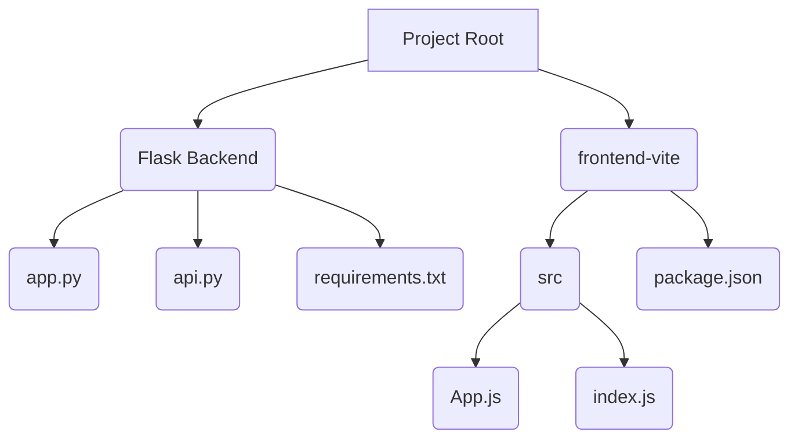

# Project Plan: MyPrompt

**Goal:** Develop a Python/Flask backend and React.js/Vite frontend application that takes a user's natural language request and returns an optimized XML prompt generated by the Google Gemini 2.5 Flash Preview 04-17 LLM.

**Technology Stack:**
*   **Backend:** Python, Flask, UV
*   **Frontend:** React.js, Vite
*   **LLM:** Google Gemini 2.5 Flash Preview 04-17

**Project Structure (Mimicking MyMCP Prompt):**

**Steps:**

1.  **Project Setup:**
    *   Create a new project directory (e.g., `myprompt`).
    *   Inside the project root, set up the Flask backend structure (`app.py`, `api.py`, `requirements.txt`).
    *   Create a `frontend-vite` directory within the project root and set up a basic React.js project using Vite (`package.json`, `src` directory with `App.js`, `index.js`, etc.).
    *   Initialize a Git repository.
    *   **Use UV to create and manage the virtual environment for the backend.**

2.  **Backend Development:**
    *   Define the Flask application in `app.py`, including CORS setup.
    *   Create the `/api/optimize-prompt` endpoint in `api.py`. This endpoint will receive the user's natural language request from the frontend.
    *   Implement the logic in `api.py` to interact with the Google Gemini API. This will involve:
        *   Retrieving the `GEMINI_API_KEY` from environment variables.
        *   Making an API call to the Gemini 2.5 Flash Preview 04-17 model with the user's request and instructions for generating an optimized XML prompt. The instructions will guide the LLM to determine the best optimization approach and XML structure.
        *   Handling the API response and extracting the generated XML prompt.
        *   Returning the XML prompt to the frontend.
    *   Define necessary dependencies in `requirements.txt` (e.g., `Flask`, `google-generativeai`, `python-dotenv` for local environment variable loading during development). **Use UV to install these dependencies.**

3.  **Frontend Development:**
    *   Develop the user interface in `frontend-vite/src/App.js`. This will include:
        *   An input area for the user to enter their natural language request.
        *   A button to trigger the prompt optimization.
        *   An area to display the returned optimized XML prompt.
    *   Implement the logic to send the user's request to the backend `/api/optimize-prompt` endpoint.
    *   Implement the logic to receive the XML prompt from the backend and display it to the user.
    *   Apply basic styling to improve the UI beyond a plain white background, even before a specific motif is chosen.

4.  **API Key Security:**
    *   Ensure the backend code strictly reads the API key from environment variables and does not hardcode it or expose it to the frontend.
    *   Provide clear instructions in the project's README on how users should set the `GEMINI_API_KEY` environment variable securely.

5.  **Testing:**
    *   Write unit tests for the backend API using a testing framework like `pytest`. Mock the external API call to the Gemini API during testing.
    *   Write unit or integration tests for the frontend components to ensure they handle user input, API calls, and output display correctly.
    *   Implement edge case testing, considering scenarios like empty input, API errors, or unexpected LLM responses. Aim for >95% test coverage.

6.  **Documentation:**
    *   Create a comprehensive `README.md` file in the project root, similar to your MyMCP Prompt README. This should include:
        *   Project description.
        *   Setup instructions (backend and frontend), specifically mentioning the use of UV.
        *   Instructions for setting the API key.
        *   Usage instructions.
        *   Project structure overview.
        *   Testing instructions.
        *   Future features.

**Workflow:**

1.  User enters natural language request in the frontend UI.
2.  Frontend sends the request to the backend `/api/optimize-prompt` endpoint.
3.  Backend retrieves the API key, calls the Gemini API with the request and optimization instructions.
4.  Gemini API returns the optimized XML prompt.
5.  Backend sends the XML prompt back to the frontend.
6.  Frontend displays the XML prompt to the user.