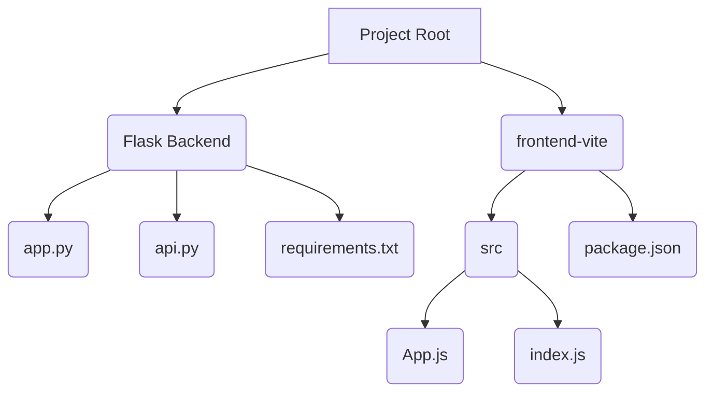

# MyPrompt

## Project Description

MyPrompt is a web application designed to take a user's natural language request and return an optimized XML prompt generated by the Google Gemini 2.5 Flash Preview 04-17 LLM. The application consists of a Python/Flask backend and a React.js/Vite frontend.

## Technology Stack

*   **Backend:** Python, Flask, UV
*   **Frontend:** React.js, Vite
*   **LLM:** Google Gemini 2.5 Flash Preview 04-17

## Project Structure



## Setup Instructions

To set up and run MyPrompt, follow these steps:

### Prerequisites

*   **Python 3.7+:** Ensure Python is installed on your system.
*   **Node.js and npm:** Ensure Node.js and npm are installed.
*   **UV:** Install UV by following the instructions on the [UV documentation](https://github.com/astral-sh/uv).

### Backend Setup

1.  Clone the GitHub repo into a directory of your chosing:
    * On Windows:
        ```bash
        git clone https://github.com/AlexJ-StL/MyPrompt.git
        ```
2.  Navigate to the project root directory in your terminal.
    * On Windows:
    ```bash
    cd MyPrompt
    ```
3.  Create a virtual environment using UV:
    ```bash
    uv init && uv .venv
    ```
4.  Activate the virtual environment:
    *   On Windows:
        ```bash
        .\.venv\Scripts\activate
        ```
    *   On macOS and Linux:
        ```bash
        source ./.venv/bin/activate
        ```
5.  Install the backend dependencies using UV:
    ```bash
    uv pip install -r requirements.txt
    ```
    or
    ```bash
    uv sync
    ```
6.  Set your Google Gemini API key as an environment variable. It is recommended to use a `.env` file for local development. Create a file named `.env` in the project root and add the following line, replacing `YOUR_GEMINI_API_KEY` with your actual API key:
    ```
    GEMINI_API_KEY=YOUR_GEMINI_API_KEY
    ```
    Ensure the `.env` file is included in your `.gitignore` to prevent committing your API key.

### Frontend Setup

1.  Navigate to the `frontend-vite` directory:
    ```bash
    cd frontend-vite
    ```
2.  Install the frontend dependencies:
    ```bash
    npm install
    ```

## Usage Instructions

1.  **Start the Backend:**
    *   Navigate to the project root directory.
    *   Activate the backend virtual environment (if not already active).
    *   Run the Flask application:
        ```bash
        uv run app.py
        ```
    The backend server should start, typically on `http://127.0.0.1:5000`.

2.  **Start the Frontend:**
    *   Navigate to the `frontend-vite` directory:
        ```bash
        cd frontend-vite
        ```
    *   Start the Vite development server:
        ```bash
        npm run dev
        ```
    The frontend development server should start, typically on `http://localhost:5173`.

3.  **Use the Application:**
    *   Open your web browser and go to the frontend address (e.g., `http://localhost:5173`).
    *   Enter your natural language request in the provided input area.
    *   Click the button to trigger the prompt optimization.
    *   The optimized XML prompt will be displayed on the page.

## Testing Instructions

### Backend Testing

1.  Navigate to the project root directory.
2.  Activate the backend virtual environment.
3.  Run the pytest tests:
    ```bash
    pytest
    ```

### Frontend Testing

1.  Navigate to the `frontend-vite` directory.
2.  Run the frontend tests (assuming you have a testing framework configured, e.g., Vitest or Jest):
    ```bash
    npm test
    ```
    *(Note: Frontend tests are not fully implemented yet based on the provided files, but this is the general command.)*

## Future Features

*   Implement comprehensive frontend tests.
*   Add more advanced styling and UI/UX improvements.
*   Explore additional LLM parameters and optimization techniques.
*   Implement error handling and user feedback for API calls.
